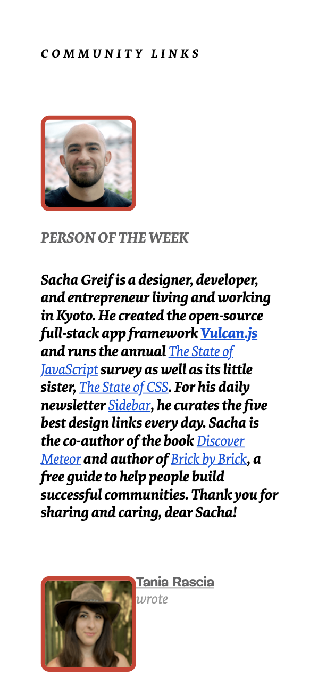
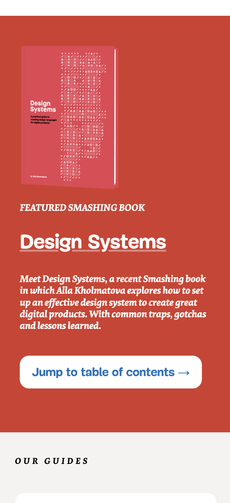
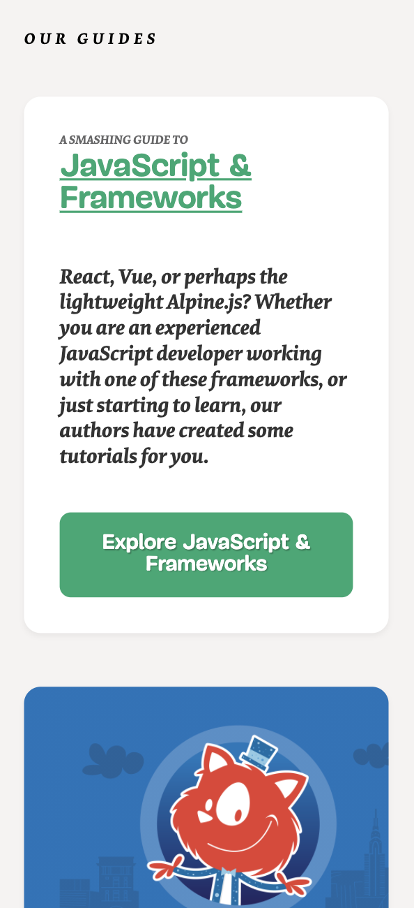
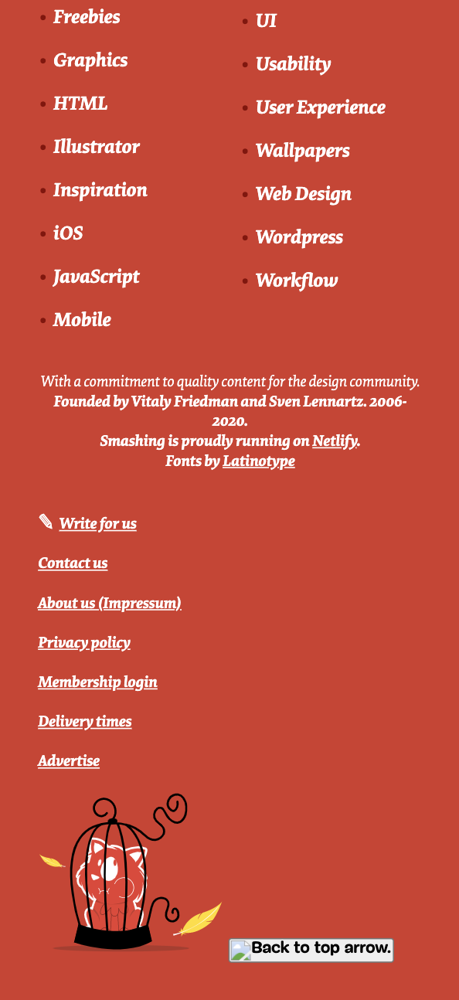
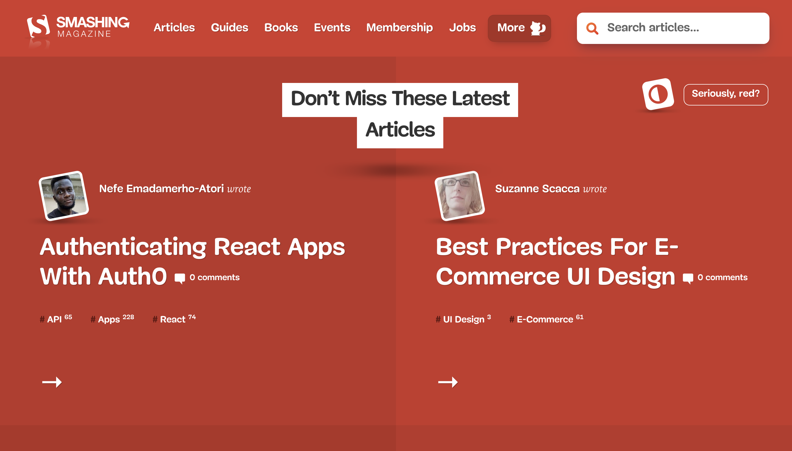

# Procesverslag
**Auteur:** -Emma Bons-

Markdown cheat cheet: [Hulp bij het schrijven van Markdown](https://github.com/adam-p/markdown-here/wiki/Markdown-Cheatsheet). Nb. de standaardstructuur en de spartaanse opmaak zijn helemaal prima. Het gaat om de inhoud van je procesverslag. Besteedt de tijd voor pracht en praal aan je website.

## Bronnenlijst
1. -bron 1-
2. -bron 2-
3. -...-

## Eindgesprek (week 7/8)

-dit ging goed & dit was lastig-

**Screenshot(s):**

-screenshot(s) van je eindresultaat-

## Voortgang 3 (week 6)

-same as voortgang 1-

## Voortgang 2 (week 5)

-same as voortgang 1-

## Voortgang 1 (week 3)

### Stand van zaken

-dit ging goed & dit was lastig:
Het schrijven van de HTML ging redelijk vlot en goed. Het schrijven van de CSS ging wel oke. Waar ik tegenaan liep waren bepaalde positioneringsdingen waar ik nog niet helemaal uit ben. Daarnaast werken mijn fonts niet goed (een bepaald font wordt bold italic waar die gewoon normaal zou moeten zijn. Dus ik ga nog even kijken of ik kan uitvogelen wat het probleem daar is en hoe ik het op kan lossen.-

**Screenshot(s) 25 november 2020:**

### Agenda voor meeting

-samen met je groepje opstellen-

| Charlie        | Emma                          | Jon          | Martijn          | Nine                |
| ---            | ---                           | ---          | ---              | ---                 |
| centreren      | fonts met @font-face          | w3c          | zonder classes?  | w3c error           |
|                | waar op letten met responsive | header img   |                  | img achtergr header |
|                | w3c                           |              |                  |                     |

### Verslag van meeting

-voortgangs meeting-

## Breakdownschets (week 1)

## Intake (week 1)
-uitwerken voor de kick-off werkgroep - begin van de eerste week-

**Je startniveau:** -Rood-

**Je focus:** -Ik ga me focussen op wat extra aandacht aan de surface plane, en als het lukt probeer ik hem ook helemaal responsive te maken.-

**Je opdracht:** -(https://www.smashingmagazine.com/ "Smashing Magazine Homepage")-

**Screenshot(s) van de eerste pagina (small screen):**

**Screenshot(s) van de tweede pagina (small screen):** -(https://www.smashingmagazine.com/2020/11/authenticating-react-apps-auth0/)-

